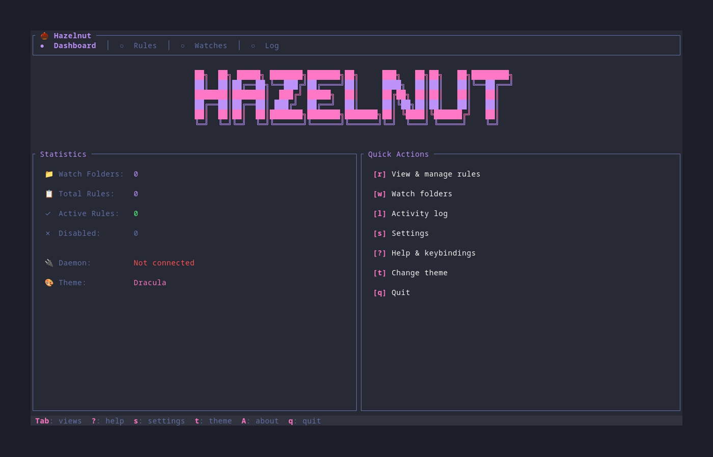
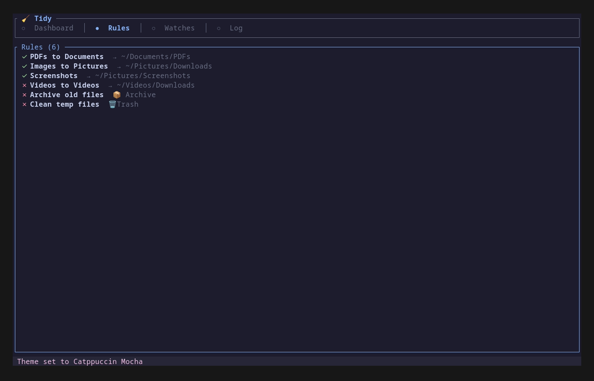
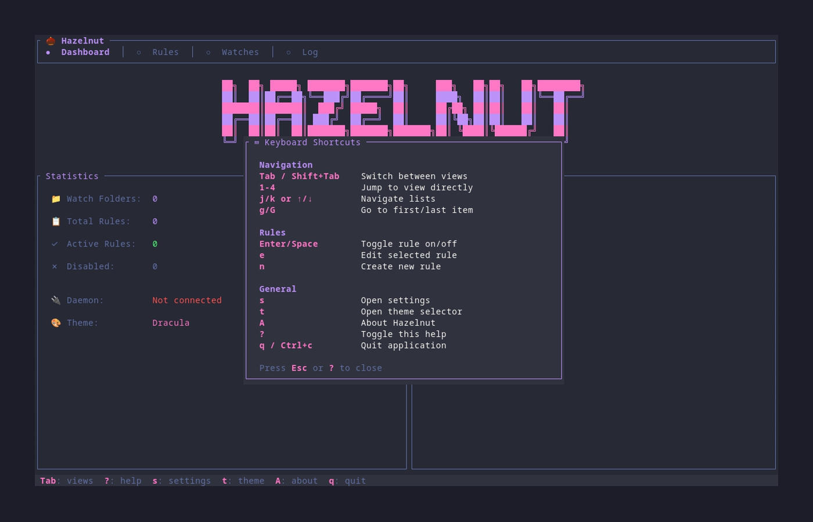
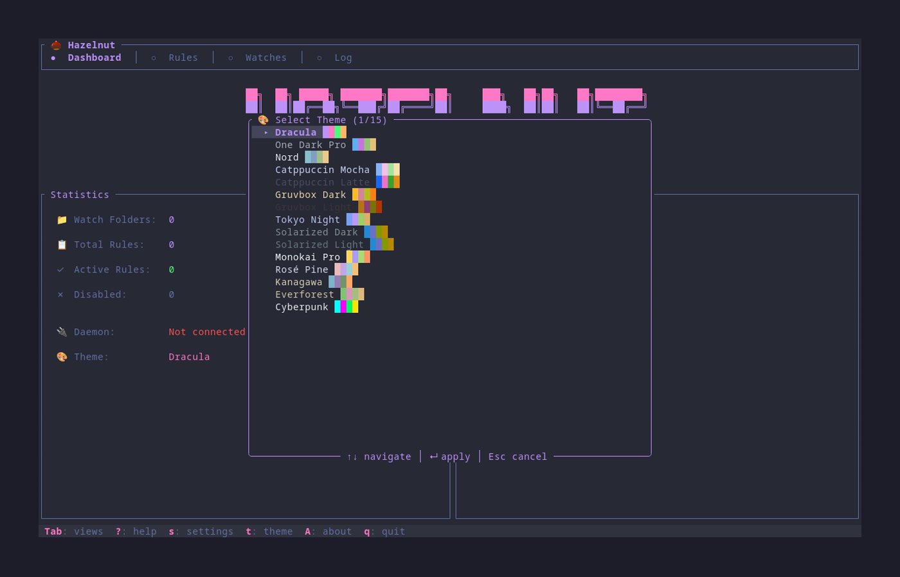
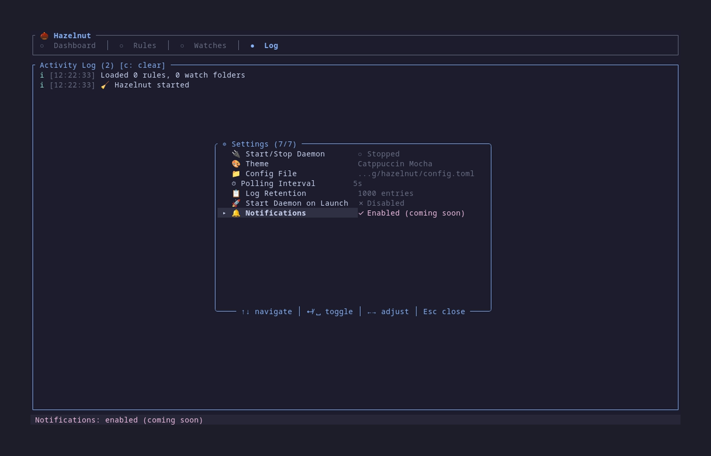

<p align="center">
  
</p>

<h1 align="center">
  🧹 Hazelnut
</h1>

<p align="center">
  <strong>A terminal-based automated file organizer inspired by <a href="https://www.noodlesoft.com/">Hazel</a></strong>
</p>

<p align="center">
  <i>Watch your folders and automatically organize files based on rules you define — all from your terminal.</i>
</p>

<p align="center">
  <a href="https://github.com/ricardodantas/hazelnut/releases">
    
  </a>
  <a href="https://crates.io/crates/hazelnut">
    
  </a>
  <a href="https://github.com/ricardodantas/hazelnut/actions">
    
  </a>
  <a href="https://github.com/ricardodantas/hazelnut/blob/main/LICENSE">
    
  </a>
  <a href="https://rust-lang.org">
    
  </a>
</p>

<br>

## 📖 Table of Contents

- [✨ Features](#-features)
- [🚀 Quick Start](#-quick-start)
- [⚙️ Configuration](#️-configuration)
- [📋 Rules](#-rules)
- [⌨️ Keybindings](#️-keybindings)
- [🎨 Themes](#-themes)
- [🏗️ Architecture](#️-architecture)
- [🔧 Building from Source](#-building-from-source)
- [🤝 Contributing](#-contributing)
- [📄 License](#-license)

<br>

## ✨ Features

<table>
<tr>
<td width="50%">

### 📁 Smart File Watching
Watch any folder for new and changed files with configurable debouncing and recursive monitoring.

### 🎯 Flexible Rules Engine
Define powerful rules with conditions based on name, extension, size, age, and more.

### ⚡ Powerful Actions
Move, copy, rename, delete, archive files, or run custom scripts — all automated.

</td>
<td width="50%">

### 🖥️ Beautiful TUI
A gorgeous terminal interface for managing rules and monitoring activity in real-time.

### 🔧 Background Daemon
Set it and forget it — the daemon runs quietly and applies rules 24/7.

### 📝 Simple Configuration
Human-readable TOML config that's easy to write and maintain.

</td>
</tr>
</table>

<br>

### Feature Highlights

| Feature | Description |
|---------|-------------|
| 🔍 **Pattern Matching** | Glob patterns and regex for precise file matching |
| 📊 **Size Conditions** | Filter files by size (greater than, less than) |
| 📅 **Age Conditions** | Match files by modification date |
| 🏷️ **Multiple Extensions** | Match any of multiple file types |
| 📂 **Recursive Watching** | Monitor subdirectories automatically |
| 🎨 **15 Built-in Themes** | From Dracula to Cyberpunk |
| 🔄 **Dry Run Mode** | Preview what would happen before applying |
| 📋 **Activity Log** | Full history of all file operations |

<br>

## 🚀 Quick Start

### Installation

#### Homebrew (Recommended)

```bash
brew install ricardodantas/tap/hazelnut
```

#### Cargo

```bash
cargo install hazelnut-cli
```

#### From Source

```bash
git clone https://github.com/ricardodantas/hazelnut
cd hazelnut
cargo install --path .
```

### First Run

1. **Create a config file** at `~/.config/hazelnut/config.toml`:

```toml
# Watch your Downloads folder
[[watch]]
path = "~/Downloads"

# Organize PDFs automatically
[[rule]]
name = "Organize PDFs"

[rule.condition]
extension = "pdf"

[rule.action]
type = "move"
destination = "~/Documents/PDFs"
```

2. **Launch the TUI** to manage and monitor:

```bash
hazelnut
```

3. **Or start the daemon** to run in the background:

```bash
hazelnutd start
```

<p align="center">
  
</p>

<br>

## ⚙️ Configuration

Hazelnut uses [TOML](https://toml.io) for configuration. The default location is:

```
~/.config/hazelnut/config.toml
```

### Full Configuration Example

```toml
# ─────────────────────────────────────────────────────────────
# General Settings
# ─────────────────────────────────────────────────────────────

[general]
# Logging level: trace, debug, info, warn, error
log_level = "info"

# Optional log file path
log_file = "~/.local/share/hazelnut/hazelnut.log"

# Preview actions without executing (great for testing)
dry_run = false

# Wait time (seconds) before processing a file after change detected
debounce_seconds = 2

# Theme for the TUI
theme = "catppuccin-mocha"

# ─────────────────────────────────────────────────────────────
# Watch Folders
# ─────────────────────────────────────────────────────────────

[[watch]]
path = "~/Downloads"
recursive = false

[[watch]]
path = "~/Desktop"
recursive = false
# Only apply specific rules to this folder
rules = ["screenshots", "temp-files"]

[[watch]]
path = "~/Documents/Inbox"
recursive = true  # Watch subdirectories too

# ─────────────────────────────────────────────────────────────
# Rules
# ─────────────────────────────────────────────────────────────

[[rule]]
name = "Organize PDFs"
enabled = true
stop_processing = false  # Continue checking other rules

[rule.condition]
extension = "pdf"

[rule.action]
type = "move"
destination = "~/Documents/PDFs"
create_destination = true
overwrite = false

[[rule]]
name = "Screenshots"
enabled = true

[rule.condition]
name_matches = "Screenshot*.png"

[rule.action]
type = "move"
destination = "~/Pictures/Screenshots"

[[rule]]
name = "Clean Old Downloads"
enabled = true

[rule.condition]
age_days_greater_than = 30
extensions = ["tmp", "log", "bak"]

[rule.action]
type = "trash"
```

See [docs/configuration.md](docs/configuration.md) for the complete reference.

<br>

## 📋 Rules

Rules are the heart of Hazelnut. Each rule has a **condition** (what files to match) and an **action** (what to do with them).

### Conditions

All conditions in a rule must match for the rule to apply.

#### File Name

```toml
[rule.condition]
# Glob pattern matching
name_matches = "Screenshot*.png"

# Regex pattern matching
name_regex = "^invoice_\\d{4}\\.pdf$"
```

#### File Extension

```toml
[rule.condition]
# Single extension
extension = "pdf"

# Multiple extensions (match any)
extensions = ["jpg", "jpeg", "png", "gif", "webp"]
```

#### File Size

```toml
[rule.condition]
# Size in bytes
size_greater_than = 10485760  # > 10 MB
size_less_than = 1048576      # < 1 MB
```

#### File Age

```toml
[rule.condition]
# Age in days (based on modification time)
age_days_greater_than = 30  # Older than 30 days
age_days_less_than = 7      # Newer than 7 days
```

#### File Type

```toml
[rule.condition]
is_directory = false  # Match only files
is_hidden = true      # Match hidden files (starting with .)
```

### Actions

#### Move

```toml
[rule.action]
type = "move"
destination = "~/Documents/Archive"
create_destination = true  # Create folder if missing
overwrite = false          # Don't overwrite existing files
```

#### Copy

```toml
[rule.action]
type = "copy"
destination = "~/Backup"
create_destination = true
overwrite = false
```

#### Rename

```toml
[rule.action]
type = "rename"
pattern = "{date}_{name}.{ext}"
```

**Available variables:**

| Variable | Description | Example |
|----------|-------------|---------|
| `{name}` | Filename without extension | `document` |
| `{filename}` | Full filename | `document.pdf` |
| `{ext}` | Extension | `pdf` |
| `{path}` | Full path | `/home/user/document.pdf` |
| `{dir}` | Parent directory | `/home/user` |
| `{date}` | Current date | `2024-01-15` |
| `{datetime}` | Current datetime | `2024-01-15_14-30-00` |
| `{date:FORMAT}` | Custom format | `{date:%Y%m%d}` → `20240115` |

#### Trash

```toml
[rule.action]
type = "trash"
```

Moves files to the system trash (recoverable).

#### Delete

```toml
[rule.action]
type = "delete"
```

> ⚠️ **Warning**: This permanently deletes files!

#### Run Command

```toml
[rule.action]
type = "run"
command = "convert"
args = ["{path}", "-resize", "50%", "{dir}/{name}_small.{ext}"]
```

#### Archive

```toml
[rule.action]
type = "archive"
destination = "~/Archives"
delete_original = false
```

### Rule Editor (TUI)

You can create and edit rules directly in the TUI without editing the config file:

1. **Create a new rule**: Press `n` in the Rules view
2. **Edit an existing rule**: Select a rule and press `e`
3. **Delete a rule**: Select a rule and press `d`

The rule editor dialog allows you to configure:

- **Name** - A descriptive name for your rule
- **Enabled** - Toggle the rule on/off
- **Conditions** - Extension, name patterns (glob/regex), size limits, age limits, is_directory, is_hidden
- **Action** - Move, Copy, Rename, Trash, Delete, Run Command, or Archive

Use `Tab` to move between fields, `Enter` to save, and `Esc` to cancel.

### Example Rules

<details>
<summary><strong>📸 Organize Screenshots</strong></summary>

```toml
[[rule]]
name = "Screenshots to folder"

[rule.condition]
name_matches = "Screenshot*.png"

[rule.action]
type = "move"
destination = "~/Pictures/Screenshots"
```
</details>

<details>
<summary><strong>📄 Sort Documents by Type</strong></summary>

```toml
[[rule]]
name = "PDFs to Documents"

[rule.condition]
extension = "pdf"

[rule.action]
type = "move"
destination = "~/Documents/PDFs"

[[rule]]
name = "Spreadsheets to Documents"

[rule.condition]
extensions = ["xlsx", "xls", "csv"]

[rule.action]
type = "move"
destination = "~/Documents/Spreadsheets"
```
</details>

<details>
<summary><strong>🗑️ Clean Old Files</strong></summary>

```toml
[[rule]]
name = "Delete old temp files"

[rule.condition]
age_days_greater_than = 30
extensions = ["tmp", "log", "bak"]

[rule.action]
type = "trash"
```
</details>

<details>
<summary><strong>📅 Date-Prefix Invoices</strong></summary>

```toml
[[rule]]
name = "Prefix invoices with date"

[rule.condition]
name_regex = "^invoice.*\\.pdf$"

[rule.action]
type = "rename"
pattern = "{date:YYYY-MM-DD}_{filename}"
```
</details>

<details>
<summary><strong>🖼️ Compress Large Images</strong></summary>

```toml
[[rule]]
name = "Compress large images"

[rule.condition]
extensions = ["jpg", "png"]
size_greater_than = 5242880  # > 5 MB

[rule.action]
type = "run"
command = "convert"
args = ["{path}", "-quality", "80", "{path}"]
```
</details>

<br>

## ⌨️ Keybindings

### Global

| Key | Action |
|-----|--------|
| `Tab` | Next view |
| `Shift+Tab` | Previous view |
| `1` `2` `3` `4` | Jump to view (Dashboard, Rules, Watches, Log) |
| `s` | Open settings |
| `t` | Open theme picker |
| `A` | About Hazelnut |
| `?` / `F1` | Show help |
| `q` | Quit (from Dashboard) |
| `Ctrl+c` / `Ctrl+q` | Force quit |

### Navigation

| Key | Action |
|-----|--------|
| `↑` / `k` | Move up |
| `↓` / `j` | Move down |
| `g` / `Home` | Go to first item |
| `G` / `End` | Go to last item |
| `PageUp` | Page up |
| `PageDown` | Page down |

### Rules View

| Key | Action |
|-----|--------|
| `Enter` / `Space` | Toggle rule enabled/disabled |
| `e` | Edit selected rule |
| `n` | Create new rule |
| `d` / `Delete` | Delete selected rule |

### Watches View

| Key | Action |
|-----|--------|
| `a` | Add watch folder (coming soon) |
| `d` / `Delete` | Remove watch (coming soon) |
| `o` / `Enter` | Open folder |

### Log View

| Key | Action |
|-----|--------|
| `c` | Clear log |

### Theme Picker

| Key | Action |
|-----|--------|
| `↑` / `k` | Previous theme (with live preview) |
| `↓` / `j` | Next theme (with live preview) |
| `Enter` | Apply selected theme |
| `Esc` | Cancel |

<p align="center">
  
</p>

<br>

## 🎨 Themes

Hazelnut includes **15 beautiful themes** based on popular terminal and editor color schemes.

Press `t` in the TUI to open the theme picker with live preview.

<p align="center">
  
</p>

### Available Themes

| Theme | Description |
|-------|-------------|
| 🦇 **Dracula** | Dark purple aesthetic (default) |
| 🌙 **One Dark Pro** | Atom's iconic dark theme |
| ❄️ **Nord** | Arctic, bluish color palette |
| 🐱 **Catppuccin Mocha** | Warm pastel dark theme |
| ☕ **Catppuccin Latte** | Warm pastel light theme |
| 🎸 **Gruvbox Dark** | Retro groove colors |
| 📜 **Gruvbox Light** | Retro groove, light variant |
| 🌃 **Tokyo Night** | Futuristic dark blue |
| 🌅 **Solarized Dark** | Precision colors, dark |
| 🌞 **Solarized Light** | Precision colors, light |
| 🎨 **Monokai Pro** | Classic syntax highlighting |
| 🌹 **Rosé Pine** | All natural pine with soho vibes |
| 🌊 **Kanagawa** | Inspired by Katsushika Hokusai |
| 🌲 **Everforest** | Comfortable green forest theme |
| 🌆 **Cyberpunk** | Neon-soaked futuristic theme |

<p align="center">
  
</p>

<br>

## 🏗️ Architecture

Hazelnut consists of two binaries that work together:

```
┌─────────────────────────────────────────────────────────────┐
│                         User                                │
└─────────────────────────────────────────────────────────────┘
                              │
                              ▼
┌─────────────────────────────────────────────────────────────┐
│                       hazelnut (TUI)                            │
│  • Manage rules                                             │
│  • Monitor activity                                         │
│  • Change themes                                            │
│  • View logs                                                │
└─────────────────────────────────────────────────────────────┘
                              │
                         Unix Socket
                              │
                              ▼
┌─────────────────────────────────────────────────────────────┐
│                     hazelnutd (Daemon)                          │
│  • Watch folders                                            │
│  • Evaluate rules                                           │
│  • Execute actions                                          │
│  • Run 24/7 in background                                   │
└─────────────────────────────────────────────────────────────┘
                              │
                              ▼
┌─────────────────────────────────────────────────────────────┐
│                      File System                            │
└─────────────────────────────────────────────────────────────┘
```

### `hazelnut` — The TUI

Interactive terminal interface for:
- Viewing and managing rules
- Monitoring watch folders
- Viewing activity logs
- Changing themes
- Sending commands to the daemon

```bash
hazelnut              # Launch TUI
hazelnut list         # List all rules
hazelnut check        # Validate config
hazelnut run          # Run rules once (dry-run)
hazelnut run --apply  # Run rules once (for real)
hazelnut status       # Check daemon status
```

### `hazelnutd` — The Daemon

Background service that does the actual work:

```bash
hazelnutd start      # Start daemon (background)
hazelnutd stop       # Stop daemon
hazelnutd restart    # Restart daemon
hazelnutd status     # Show daemon status
hazelnutd reload     # Reload configuration
hazelnutd run        # Run in foreground (for debugging)
```

<br>

## 🔧 Building from Source

### Requirements

- **Rust 1.93+** (uses Edition 2024 features)
- **Linux** or **macOS**

### Build

```bash
# Clone the repository
git clone https://github.com/ricardodantas/hazelnut
cd hazelnut

# Build release binary
cargo build --release

# The binaries will be at:
# - target/release/hazelnut
# - target/release/hazelnutd

# Or install directly
cargo install --path .
```

### Development

```bash
# Run TUI in development
cargo run

# Run daemon in foreground
cargo run --bin hazelnutd run

# Run with sample config
cargo run -- --config examples/config.toml

# Run tests
cargo test

# Run linter
cargo clippy

# Format code
cargo fmt
```

<br>

## 🤝 Contributing

Contributions are welcome! Please see [CONTRIBUTING.md](CONTRIBUTING.md) for guidelines.

### Quick Start for Contributors

1. Fork the repository
2. Create a feature branch: `git checkout -b feature/amazing-feature`
3. Make your changes
4. Run tests: `cargo test`
5. Run clippy: `cargo clippy`
6. Format: `cargo fmt`
7. Commit: `git commit -m "Add amazing feature"`
8. Push: `git push origin feature/amazing-feature`
9. Open a Pull Request

### Project Structure

```
hazelnut/
├── src/
│   ├── main.rs          # TUI entry point
│   ├── daemon.rs        # Daemon entry point
│   ├── lib.rs           # Library root
│   ├── theme.rs         # Color themes
│   ├── app/             # TUI application
│   │   ├── events.rs    # Key event handling
│   │   ├── state.rs     # Application state
│   │   └── ui.rs        # UI rendering
│   ├── config/          # Configuration loading
│   ├── rules/           # Rule engine
│   │   ├── action.rs    # Rule actions
│   │   ├── condition.rs # Rule conditions
│   │   └── engine.rs    # Rule evaluation
│   ├── watcher/         # File system watcher
│   └── ipc/             # TUI-daemon communication
├── docs/
│   └── configuration.md # Full config reference
├── screenshots/         # Screenshots for docs
└── tests/               # Integration tests
```

<br>

## 📄 License

This project is licensed under the **MIT License** — see the [LICENSE](LICENSE) file for details.

---

<p align="center">
  <sub>Built with 🦀 Rust and ❤️ by <a href="https://github.com/ricardodantas">Ricardo Dantas</a></sub>
</p>
